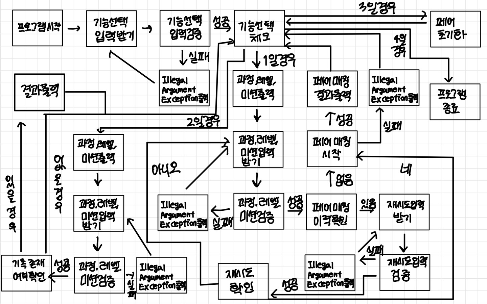

## :heavy_check_mark: 조건

### 규칙
- 페어에 관하여
    - 백엔드 과정 & 프론트엔드 과정
    - 5단계의 레벨로 각 레벨에서 전달하고자 하는 내용을 학습 => 미션이 있음
    - 미션을 수행하며 페어 프로그래밍을 진행
    - 크루 정보, 과정, 레벨, 미션 정보는 제공하는 그대로 사용
- 페어 매칭
    - 매칭 대상이 홀수인 경우 마지막 남은 크루는 마지막 페어에 포함
    - 같은 레벨에서 이미 페어를 맺은 크루와는 다시 페어로 매칭하지 않음
    - 이름 목록을 List<String> 형태로 준비
    - 크루 목록 순서를 랜덤으로 섞어 앞에서부터 두명씩
    - 만난적이 있는 크루끼리 다시 페어로 매칭 된다면 크루 목록의 순서를 다시 랜덤으로 섞어서 매칭을 시도
    - 3회 시도까지 매칭이 되지 않거나 매칭을 할 수 없는 경우 에러 메시지 출력
- 페어 조회
    - 과정, 레벨, 미션을 선택하면 해당 미션의 페어 정보 출력
    - 매칭 이력이 없으면 없다고 안내
- 페어 초기화
- 종료

 
### 입출력
- 입력
    - 크루 이름의 경우 파일 입출력 사용, 크루 이름은 중복될 수 없음
    - 사용자가 잘못된 값을 입력할 경우 IllegalArgumentException 발생 후 다시 입력 받음
- 출력
    - 기능 선택 메뉴 출력
    - 페어 매칭 안내 출력
    - 페어 매칭 결과 출력
    - 페어 매칭 선택 시 이미 결과가 있을 경우 안내 문구 출력
    - 페어 초기화 출력

### 참고 사항
- 기존 규칙들 외 특이 사항 없음
- 과정, 레벨, 크루 예시 코드 참고

## :heavy_check_mark: 플로우 차트

## :heavy_check_mark: 구현
- Course 
  - 필드: 과정 이름 리스트, 현재 과정 이름
  - 과정 이름 같은지 조회
  - 과정 이름 검증
- Level
  - 필드 : 레벨과 미션 Map, 현재 레벨, 현재 미션
  - 레벨 같은지 조회
  - 미션 같은지 조회
  - 레벨과 미션 검증
- Crew
  - 필드: 과정, 이름
    - 해당 과정이면 이름을 return
- CrewGroup
  - 필드: 백엔드 크루 이름 리스트, 프론트엔드 크루 이름 리스트
  - 파일 입출력을 통해 크루 그룹 생성
  - 백엔드 이름 리스트 셔플 제공
  - 프론트 크루 이름 리스트 셔플 제공
- Pair
  - 필드 : 과정, 레벨, 크루 이름 리스트
  - 과정 레벨 미션 일치 시 크루 이름 리스트 제공
  - 과정 레벨 일치 시 크루 이름 리스트 제공
  - 페어 매칭
  - 이름 리스트 제공 시 페어 중복 확인
- PairGroup
  - 필드: 페어 리스트
  - 페어 그룹 초기화
  - 페어 추가
  - 페어 삭제
  - 페어 과정, 레벨, 미션 조회
  - 페어 과정, 레벨 조회
- PairController
  - 기능 선택
  - 페어 매칭 진행
  - 페어 조회 진행
  - 페어 초기화 진행
  - 종료
- InputView
  - 기능 선택 입력 받기
  - 기능 선택 입력 검증
  - 과정, 레벨, 미션 입력 받기
  - 과정, 레벨, 미션 입력 검증
  - 재시도 입력 받기
  - 재시도 입력 검증
  - 공백 제거
- OutputView
  - 기능 선택 출력
  - 과정, 레벨, 미션 출력
  - 페어 매칭 결과 출력
  - 초기화 완료 출력
- CourseException
  - 가능한 과정이 아닐 경우
- LevelException
  - 가능한 레벨이 아닐 경우
  - 가능한 미션이 아닐 경우
- InputException
  - 기능 선택 시 한 글자가 아닐 경우
  - 기능 선택 시 가능한 선택 항목이 아닐 경우
  - 과정, 레벨, 미션 선택시 ,로 분리하면 세 항목이 나오지 않을경우
  - 재시도 입력 시 네 혹은 아이오가 아닐 경우
